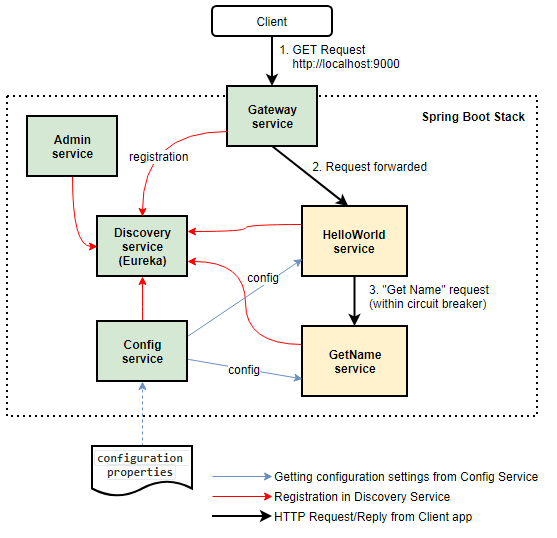

# Forked from https://github.com/bluerei/microservices-hello-world

## 'Hello World' Application with Spring Boot Microservice  Stack

This is simple microservice application designed to illustrate  the basic concept of Microservice Architecture and to provide a starting point for future development of any business application. 

#### Requirements

This microservice application produces a 'Hello *World*'  messages in JSON format. The  second  part of the message is replaceable and configurable based on a  value in the property file. For example, if the property file is updated and the word '*World* ' is replaced with '*Java*', the service starts producing 'Hello *Java*' message.

#### Solution

The business logic is located in two Microservices:

| Microservice Name  | Location            | Description                                                  |
| ------------------ | ------------------- | ------------------------------------------------------------ |
| HelloWorld Service | /helloworld_service | The main service. It receives client requests,  calls GetName service  to get the second part of the greeting message,  builds the whole message and returns it to the client in JSON format. Note:  A Circuit Breaker is used in the  GetName call. |
| GetName Service    | /getname_service    | Provides the second part of the 'Hello *World*' message from `/config_dir/getname-service.properties` file. |

This implementation is based on Spring Boot v2.2.2 and Spring Cloud Netflix frameworks. 

#### Deployment

There are several ways to deploy these microservices.  The easiest way is to run them on a local machine  as normal Java applications. 

Here is  preferable order to start these microservices  with  user interface or endpoint URLs:

| Microservice Name          | Location            | Access URL             | Description                                                  |
| -------------------------- | ------------------- | ---------------------- | ------------------------------------------------------------ |
| Discovery Service (Eureka) | /eureka_service     | http://localhost:8761/ | Provides registration, discovery and load balancing functionality for the other microservices. |
| Config Service             | /config_service     | N/A                    | Provides microservices  with externalized configuration information. |
| Admin Service              | /admin_service      | http://localhost:8080/ | Provides a user interface for for managing and monitoring  all microservices within the stack. |
| GetName Service            | /getname_service    | http://localhost:8887/ | Functional microservice. Retrieves the second part of the 'Hello *World*' message. |
| HelloWorld Service         | /helloworld_service | http://localhost:8886/ | The main functional microservice.  Produces a 'Hello *World*'  messages in JSON format.  This endpoint URL  is accessible from within the microservices stack. |
| Gateway Service            | /gateway_service    | http://localhost:9000/ | Provides an access to HelloWorld Service  endpoint from outside of microservices stack. Usually, for security reason the only open port in the firewall  is the port of  the Gateway Service. |

